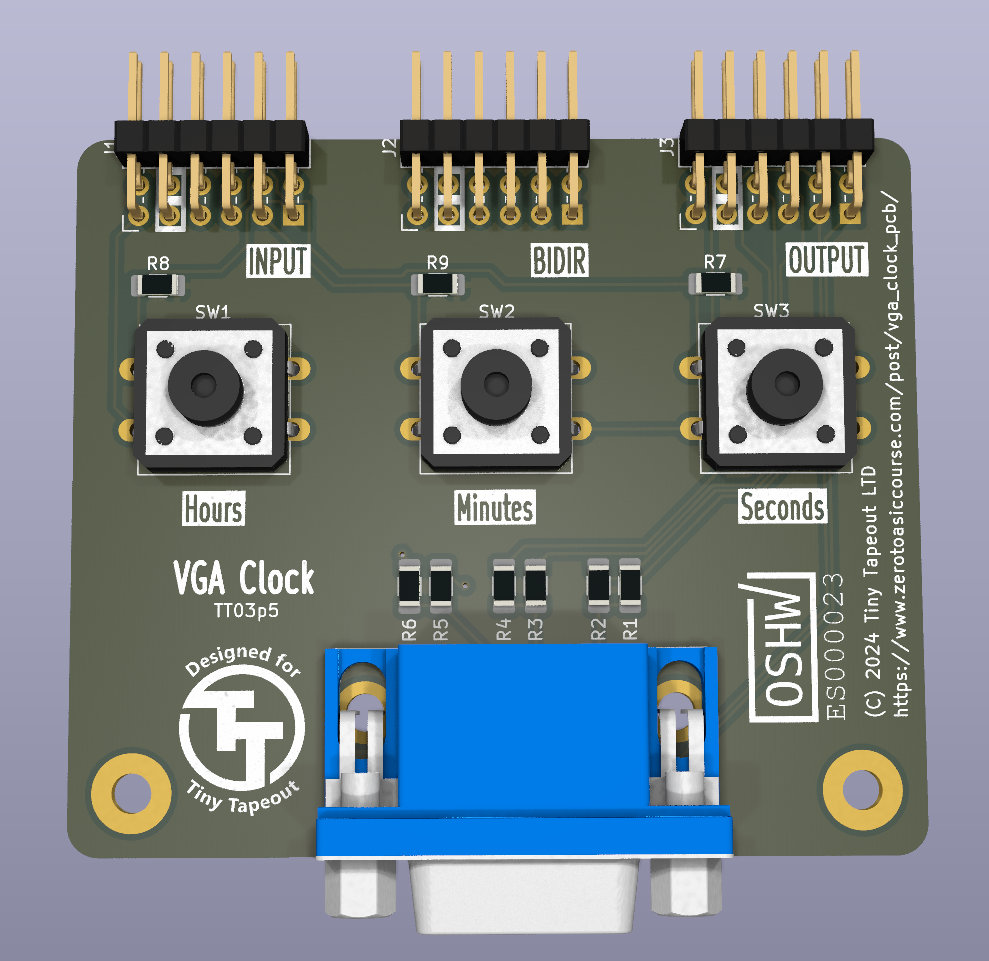

# VGA Clock PMOD for Tiny Tapeout

A PCB for the Tiny Tapeout [VGA Clock](https://github.com/urish/tt04-simon-game) project.

[Schematic](tt-vga-clock-pmod.pdf)

## Hardware

- 3 Push buttons
- 1 VGA connector
- 3 PMOD connectors (you can also get away with 2)

## License

This project is licensed under the [Apache 2.0](LICENSE) license.
